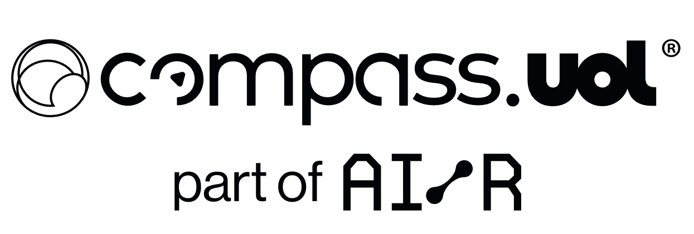

# ReadMe.md




# 🎟️ API de **API de Cinema PBs**

Bem-vindo ao repositório da **Challenge Final(Sprint 8) - Scholarship**!

Essa API foi desenvolvida para gerenciar informações de filmes e permitir a reserva de ingressos de forma prática e eficiente.  

---

## 📋 **Objetivo**

O projeto visa atender dois principais objetivos:

1. Gerenciamento de filmes, verificando se a rota /movies cadastra, atualiza, lista e exclui filmes.
2. Reserva de ingressos, verificando se a rota /tickets pode selecionar assentos, preços e horários de exibição.

---

## 🛠️ **Ferramentas e Tecnologias Utilizadas**

- **Node.js**: Ambiente de execução JavaScript.
- **Playwright**: Framework para automação de testes de ponta a ponta, com suporte para múltiplos navegadores e testes em UI.
- **JMeter**: Ferramenta de teste de carga para medir o desempenho e a capacidade de escalabilidade de aplicativos e serviços.
- **K6**: Plataforma de teste de desempenho para APIs e sistemas distribuídos, focada em facilitar testes de carga e performance em ambientes de produção.
- **Swagger**: Documentação da API.

---

## 🚀 **Instalação**

### **Pré-requisitos**

Certifique-se de que você possui as seguintes ferramentas instaladas:

- [Node.js (v21+)](https://nodejs.org/) (https://nodejs.org/)
- [NPM ou Yarn](https://nodejs.org/) (https://nodejs.org/)

### **Clonando o Repositório**

Use o comando abaixo para clonar o projeto para o seu computador:

```bash
git clone <https://github.com/juniorschmitz/nestjs-cinema.git>

```
Após clonar o repositório, instale as dependências:
```bash
npm i

```

## Sobre Mim
```markdown
Olá! Eu sou o Alisson, estudante de Ciência da Computação, atualmente focado na área de Quality AI. Neste repositório, compartilho um pouco do que estou aprendendo e desenvolvendo durante a Sprint 1 do projeto PB QualityAI.

    Experiências em:
    * C++;
    * JAVA;
    * Python;
    * React.JS;
    * Node.JS;
    * Javascript;
    * TypeScript;
    * SQL;
    * Git;  
```

.
